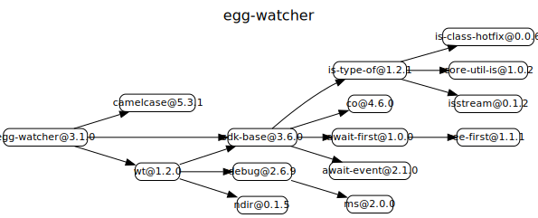
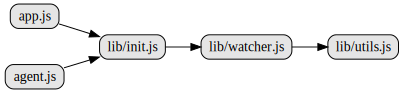

# egg-watcher

# 源码分析

底层基于ws模块负责文件监听，这里进行了配置和默认eventSource的封装。库本身是继承自sdk-base。
文件监听后对外抛出事件。


## 文件结构

``` bash
├── agent.js - 直接依赖lib/init.js
├── app.js - 直接依赖lib/init.js
├── config
|  ├── config.default.js - 配置，提供eventSources指向event-sources文件夹
|  ├── config.local.js
|  └── config.unittest.js
├── lib
|  ├── event-sources
|  |  ├── default.js
|  |  └── development.js - 基于ws模块，监听文件夹下修改内容，抛出事件change
|  ├── init.js - 对日志进行处理，在beforeStart阶段调用lib/watcher.js的ready()
|  ├── utils.js
|  └── watcher.js - 继承自sdk-base模块，基于配置中的eventSource，默认是lib/event-sources/development.js，监听后对外抛事件
```

## 对外模块依赖



## 内部模块依赖



## 逐个文件分析

### app.js

直接依赖lib/init.js

### agent.js

直接依赖lib/init.js

### lib/init.js

从app.coreLogger拿到日志对象，监听watcher对象，输出日志。
在app.beforeStart时，调用基于lib/watcher.js封装的watcher.ready()方法。

### lib/watcher.js

继承自sdk-base模块[源码分析](https://github.com/FunnyLiu/sdk-base/tree/readsource)，找到配置中的eventSource也就是lib/event-sources/development.js，进行文件监听并外抛事件。


## Usage

In worker process:

### app.watcher.watch(path, listener)
Start watching file(s).

- path(String|Array): file path(s)
- listener(Function): file change callback

### app.watcher.unwatch(path[, listener])
Stop watching file(s).

- path(String|Array): file path(s)
- listener(Function): file change callback

In agent process:

### agent.watcher.watch(path, listener)
Start watching file(s).

- path(String|Array): file path(s)
- listener(Function): file change callback

### agent.watcher.unwatch(path[, listener])
Stop watching file(s).

- path(String|Array): file path(s)
- listener(Function): file change callback

## Watching mode

### `development` Mode

There's a built-in [development mode](https://github.com/eggjs/egg-watcher/blob/master/lib/event-sources/development.js) which works in local(env is `local`). Once files on disk is modified it will emit a `change` event immediately.

### Customize Watching Mode

Say we want to build a custom event source plugin (package name: `egg-watcher-custom`, eggPlugin.name: `watcherCustom`).

Firstly define our custom event source like this:

```js
// {plugin_root}/lib/custom_event_source.js
const Base = require('sdk-base');

class CustomEventSource extends Base {
  // `opts` comes from app.config[${eventSourceName}]
  // `eventSourceName` will be registered later in
  // `config.watcher.eventSources` as the key shown below
  constructor(opts) {
    super(opts);
    this.ready(true);
  }

  watch(path) {
    // replace this with your desired way of watching,
    // when aware of any change, emit a `change` event
    // with an info object containing `path` property
    // specifying the changed directory or file.
    this._h = setInterval(() => {
      this.emit('change', { path });
    }, 1000);
  }

  unwatch() {
    // replace this with your implementation
    if (this._h) {
      clearInterval(this._h);
    }
  }
}

module.exports = CustomEventSource;
```

Event source implementations varies according to your running environment. When working with vagrant, docker, samba or such other non-standard way of development, you should use a different watch API specific to what you are working with.

Then add your custom event source to config:

```js
// config.default.js
exports.watcher = {
  eventSources: {
    custom: require('../lib/custom_event_source'),
  },
};
```

Choose to use your custom watching mode in your desired env.

```js
// config.${env}.js
exports.watcher = {
  type: 'custom',
};

// this will pass to your CustomEventSource constructor as opts
exports.watcherCustom = {
  // foo: 'bar',
};
```

If possible, plugins named like `egg-watcher-${customName}`(`egg-watcher-vagrant` eg.) are recommended.

## Questions & Suggestions

Please open an issue [here](https://github.com/eggjs/egg/issues).

## License

[MIT](https://github.com/eggjs/egg-watcher/blob/master/LICENSE)
